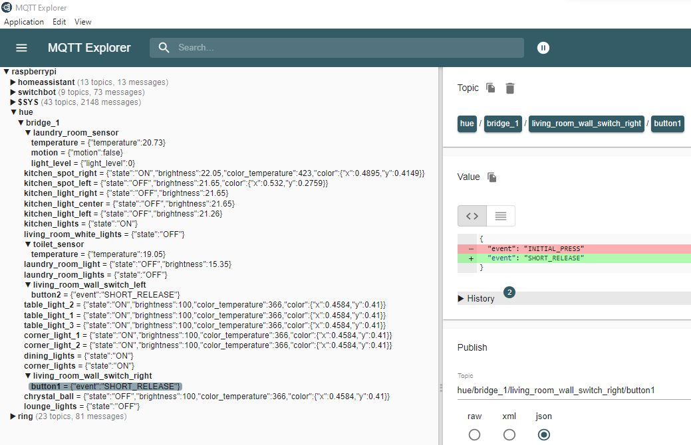

# Hue2Mqtt

Leverages the Server Side Events from the Philips Hue V2 API and publishes the status updates to an MQTT broker. Written in .NET 6.0 and currently used on a Raspberry Pi 3 Model B+.

See (https://developers.meethue.com/develop/hue-api-v2/core-concepts/)

